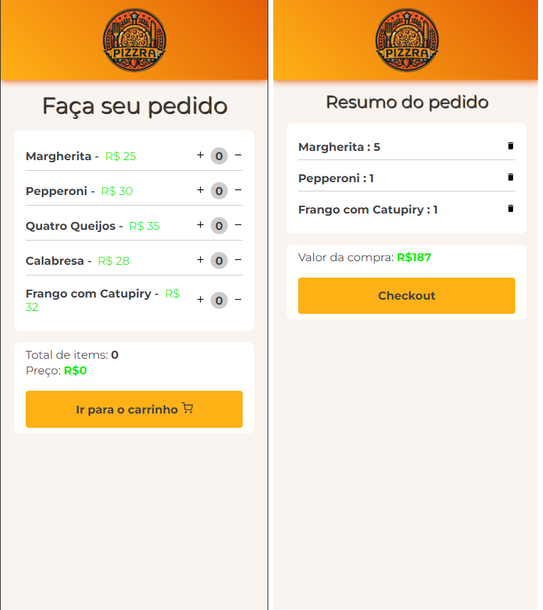

# Projeto - Carrinho de compras

     

## Layout

## Demonstração

- [Link do projeto]()

## Tecnologias utilizadas

- [React](https://react.dev/)
- [Typescript](https://www.typescriptlang.org/)
- [Styled-Components](https://styled-components.com/)
- [React-icons](https://react-icons.github.io/react-icons/)
- [Zustand](https://zustand-demo.pmnd.rs/)
- [React router](https://reactrouter.com/en/main)
